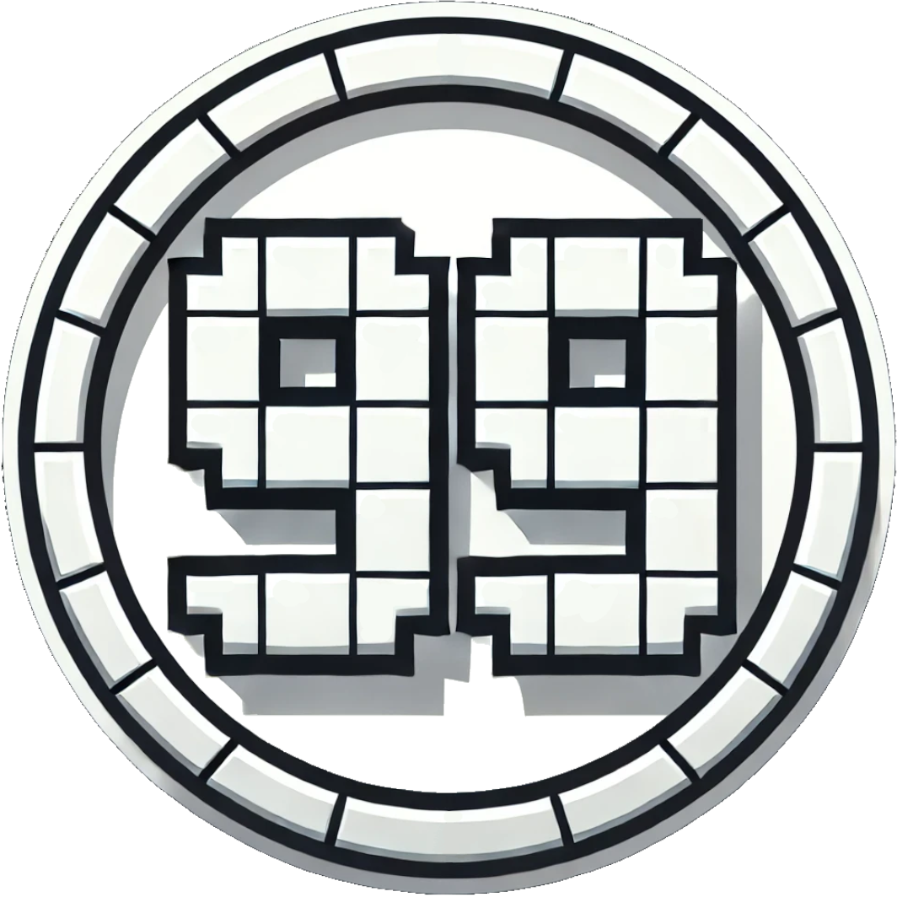

# Counter

The **Counter Mod** introduces **Day** and **Death Counters** to your Minecraft experience, allowing players to track world progression and maintain an organized record of their own (or others') deaths.

Additionally, the mod offers an option to replace the **vanilla ping bars** in the player list (**Tab menu**) with a **color-coded numeric ping**, providing a precise latency display (e.g., `123ms`) at a glance.

The **Time Counter** feature displays the current in-game time of day.

The **Coords Counter** feature displays the current coordinates of the player, making it easier to navigate and share locations with others.

All features are **highly configurable**, making this mod an excellent choice for both **singleplayer and multiplayer servers**.

## **✨ Features**
✅ **Day Counter**
- Shows the **current Minecraft day**.
- Can be displayed as an **overlay** or in **chat when joining** a world.
- Server administrators can enable or disable **day messages**.

✅ **Death Counter**
- Tracks the **total deaths per player**.
- Supports a **screen overlay**, a **chat leaderboard**, and **admin control over death counts**.
- **Configurable leaderboard size**: Choose how many players appear in the ranking.
- **Singleplayer vs. Multiplayer**:
  - In **singleplayer**, players see only their **own deaths**.
  - In **multiplayer**, a **server-wide leaderboard** can be displayed.

✅ **Ping as Text**
- Replaces the **default ping bars** in the **Tab** list with a numeric readout (e.g., `123ms`).
- Can be **color-coded** based on latency (**Green = Good**, **Orange = Moderate**, **Red = High**).
- Easily toggled in the **client-config** (`showPingAsText`).
- If disabled, the **default vanilla ping bars** will be shown again.

✅ **Survival Counter**
- Tracks your **survival time** since the **last death**.
- Optionally shows your **best survival time**.

✅ **Time Counter**
- Displays the **current in-game time** as an overlay (e.g., `14:35`).
- Configurable in **12-hour or 24-hour format**.

✅ **Coords Counter**
- Displays the **current coordinates** of the player as an overlay (e.g., `X: 123, Y: 64, Z: -456`).
- Show the Coordinates in the chat or share them with other players.

---

> Hold the **overlay key** (default **Tab**) to temporarily show overlays.

---

## **⚙️ Configuration Options**
The Counter Mod provides extensive configuration options via **`server-config.toml`** and **`client-config.toml`**.

### **Client Configuration (`client-config.toml`)**

#### 🌞Day Counter Overlay Settings
| Option                | Default    | Description                                                                                                                               |
|-----------------------|------------|-------------------------------------------------------------------------------------------------------------------------------------------|
| `showDayOverlay`      | `true`     | Enable/disable the **day counter overlay** on the client side.                                                                            |
| `showOverlayAlways`   | `true`     | Should the **day counter overlay** always be visible? If disabled, the overlay only appears while holding the overlay key (default: Tab). |
| `dayOverlayX`         | `0.05`     | Relative X position (0.0 = left, 1.0 = right) of the day overlay.                                                                         |
| `dayOverlayY`         | `0.05`     | Relative Y position (0.0 = top, 1.0 = bottom) of the day overlay.                                                                         |
| `dayOverlaySize`      | `1.0`      | Scale factor for the day counter text size.                                                                                               |
| `dayOverlayTextColor` | `0xFFFFFF` | Color for the **day counter overlay** text.                                                                                               |

#### 💀Death Counter List Settings
| Option                  | Default    | Description                                                                                                                                      |
|-------------------------|------------|--------------------------------------------------------------------------------------------------------------------------------------------------|
| `showDeathListOverlay`  | `true`     | Enable/disable the **death counter list overlay**.                                                                                               |
| `showListOverlayAlways` | `false`    | Should the **death counter list overlay** always be visible? If disabled, the overlay only appears while holding the overlay key (default: Tab). |                       |
| `deathListX`            | `0.05`     | Relative X position for the death list overlay (0.0 = left, 1.0 = right).                                                                        |
| `deathListY`            | `0.05`     | Relative Y position for the death list overlay (0.0 = top, 1.0 = bottom).                                                                        |
| `deathListSize`         | `1`        | Scale factor for the death list text size.                                                                                                       |
| `deathOverlayWidth`     | `120`      | Maximum width (in pixels) for the **death counter list overlay**.                                                                                |
| `deathOverlayStyle`     | `TABLE`    | Style used for the **death list overlay**: **`CLASSIC`**, **`BOXED`**, **`TABLE`**.                                                              |
| `deathListTextColor`    | `0xFF0000` | Default text color for the death list overlay.                                                                                                   |
| `firstPlaceColor`       | `0xFFD700` | Color for first place in the death leaderboard.                                                                                                  |
| `secondPlaceColor`      | `0xC0C0C0` | Color for second place in the death leaderboard.                                                                                                 |
| `thirdPlaceColor`       | `0xCD7F32` | Color for third place in the death leaderboard.                                                                                                  |

#### 💀Death Counter Self Settings
| Option                  | Default    | Description                                                                                                                                          |
|-------------------------|------------|------------------------------------------------------------------------------------------------------------------------------------------------------|
| `showDeathSelfOverlay`  | `true`     | Enable/disable the **personal death counter overlay**.                                                                                               |
| `showSelfOverlayAlways` | `false`    | Should the **personal death counter overlay** always be visible? If disabled, the overlay only appears while holding the overlay key (default: Tab). |     |
| `deathSelfX`            | `0.10`     | Relative X position (0.0 = left, 1.0 = right) for your death overlay.                                                                                |
| `deathSelfY`            | `0.10`     | Relative Y position (0.0 = top, 1.0 = bottom) for your death overlay.                                                                                |
| `deathSelfSize`         | `1`        | Scale factor for the **personal death counter** text size.                                                                                           |
| `deathSelfTextColor`    | `0xFF0000` | Color for your **personal death counter** text.                                                                                                      |

#### 🛡️Survival Counter Settings
| Option                      | Default    | Description                                                                                                                                    |
|-----------------------------|------------|------------------------------------------------------------------------------------------------------------------------------------------------|
| `showSurvivalOverlay`       | `false`    | Enable/disable the **survival counter overlay** on the client side.                                                                            |
| `showSurvivalOverlayAlways` | `true`     | Should the **survival counter overlay** always be visible? If disabled, the overlay only appears while holding the overlay key (default: Tab). |            |
| `survivalOverlayX`          | `0.05`     | Relative X position (0.0 = left, 1.0 = right) of the survival overlay.                                                                         |
| `survivalOverlayY`          | `0.05`     | Relative Y position (0.0 = top, 1.0 = bottom) of the survival overlay.                                                                         |
| `survivalOverlaySize`       | `1.0`      | Scale factor for the survival counter text size.                                                                                               |
| `survivalOverlayTextColor`  | `0xFFFFFF` | Color for the **survival counter overlay** text.                                                                                               |

#### ⏰Time Counter Settings
| Option                  | Default    | Description                                                                                                                                |
|-------------------------|------------|--------------------------------------------------------------------------------------------------------------------------------------------|
| `showTimeOverlay`       | `false`    | Enable/disable the **time counter overlay** on the client side.                                                                            |
| `showTimeOverlayAlways` | `true`     | Should the **time counter overlay** always be visible? If disabled, the overlay only appears while holding the overlay key (default: Tab). |            |
| `timeOverlayX`          | `0.05`     | Relative X position (0.0 = left, 1.0 = right) of the time overlay.                                                                         |
| `timeOverlayY`          | `0.05`     | Relative Y position (0.0 = top, 1.0 = bottom) of the time overlay.                                                                         |
| `timeOverlaySize`       | `1.0`      | Scale factor for the time counter text size.                                                                                               |
| `timeOverlayTextColor`  | `0xFFFFFF` | Color for the **time counter overlay** text.                                                                                               |

#### ⏰Coords Counter Settings
| Option                    | Default    | Description                                                                                                                                  |
|---------------------------|------------|----------------------------------------------------------------------------------------------------------------------------------------------|
| `showCoordsOverlay`       | `false`    | Enable/disable the **coords counter overlay** on the client side.                                                                            |
| `showCoordsOverlayAlways` | `true`     | Should the **coords counter overlay** always be visible? If disabled, the overlay only appears while holding the overlay key (default: Tab). |            |
| `coordsOverlayX`          | `0.05`     | Relative X position (0.0 = left, 1.0 = right) of the coords overlay.                                                                         |
| `coordsOverlayY`          | `0.05`     | Relative Y position (0.0 = top, 1.0 = bottom) of the coords overlay.                                                                         |
| `coordsOverlaySize`       | `1.0`      | Scale factor for the coords counter text size.                                                                                               |
| `coordsOverlayTextColor`  | `0xFFFFFF` | Color for the **coords counter overlay** text.                                                                                               |

#### 📶Ping Settings
| Option            | Default    | Description                                                             |
|-------------------|------------|-------------------------------------------------------------------------|
| `showPingAsText`  | `true`     | Show the **ping as text** (e.g. 123ms) instead of bars in the Tab list. |
| `pingColorGood`   | `0x00FF00` | Color for low ping (<100ms).                                            |
| `pingColorMedium` | `0xFF9900` | Color for medium ping (100-249ms).                                      |
| `pingColorBad`    | `0xFF0000` | Color for high ping (>=250ms).                                          |

#### 😀Emote Settings
| Option       | Default | Description                               |
|--------------|---------|-------------------------------------------|
| `showEmojis` | `true`  | Enable or disable emojis in **overlays**. |

---

### **Server Configuration (`server-config.toml`)**

#### 🌞Day Counter Settings
| Option             | Default    | Description                                                         |
|--------------------|------------|---------------------------------------------------------------------|
| `enableDayCounter` | `true`     | Enables or disables the **Day Counter** feature on the server.      |
| `enableDayMessage` | `true`     | Displays a **chat message** whenever a new Minecraft day starts.    |
| `showOverlay`      | `true`     | Allows the **Day Counter overlay** to be shown (client can toggle). |
| `showDayInChat`    | `true`     | Shows the **current day in chat** when a player joins the server.   |
| `dayChatTextColor` | `0xFFFFFF` | Text color for the **day counter messages** in chat.                |

#### 💀Death Counter Settings
| Option               | Default | Description                                                                                                          |
|----------------------|---------|----------------------------------------------------------------------------------------------------------------------|
| `enableDeathCounter` | `true`  | Enables or disables the **Death Counter** feature on the server.                                                     |
| `showDeathOverlay`   | `true`  | Allows the **Death Counter overlay** to be shown (client can toggle).                                                |
| `maxPlayersShown`    | `5`     | Number of players displayed in the **death leaderboard**.                                                            |
| `deathOverlayMode`   | `LIST`  | Defines which **death overlay types** are allowed: **`ONLY_SELF`** (personal), **`LIST`** (leaderboard), **`BOTH`**. |

#### 💀Death Counter Chat Settings
| Option                       | Default    | Description                                                                                              |
|------------------------------|------------|----------------------------------------------------------------------------------------------------------|
| `showDeathInChat`            | `true`     | Enables **death counter** messages in chat (on join or on death).                                        |
| `showDeathInChatMode`        | `BOTH`     | When to display **death messages** in chat: **`ON_JOIN`**, **`ON_DEATH`**, or **`BOTH`**.                |
| `deathChatMode`              | `LIST`     | Chat mode: **`ONLY_SELF`** (each player sees only their own total) or **`LIST`** (show a leaderboard).   |
| `showDeathListOnDeathGlobal` | `false`    | If `true`, shows the **death list** to all players when someone dies; otherwise only the victim sees it. |
| `deathListChatTextColor`     | `0xFFFFFF` | Text color for **death counter messages** in chat.                                                       |
| `deathSelfChatTextColor`     | `0xFFFFFF` | Text color for **personal death messages** in chat.                                                      |

#### 🛡️Survival Counter Settings
| Option                           | Default | Description                                                                                                                   |
|----------------------------------|---------|-------------------------------------------------------------------------------------------------------------------------------|
| `enableSurvivalCounter`          | `true`  | Enables or disables the **Survival Counter** feature on the server.                                                           |
| `showSurvivalOverlay`            | `true`  | Allows the **Survival Counter overlay** to be shown (client can toggle).                                                      |
| `survivalUseRealTime`            | `false` | Measure survival time in real-world time instead of Minecraft days.                                                           |
| `survivalTimeFormat`             | `FULL`  | Display format for survival time: **`FULL`**, **`DAYS_HOURS`**, **`HOURS_MINUTES`**,  **`DAYS`**, **`HOURS`**, **`MINUTES`**. |
| `showBestSurvivalTime`           | `false` | Show the best survival time instead of the most recent one.                                                                   |
| `showBestSurvivalInDeathCounter` | `false` | Append the best survival time to death counter messages.                                                                      |
| `survivalHistorySize`            | `10`    | Number of survival time entries kept per player.                                                                              |

#### 🛡️Survival Counter Chat Settings
| Option                     | Default | Description                                                            |
|----------------------------|---------|------------------------------------------------------------------------|
| `showSurvivalInChat`       | `false` | Send a chat message with the survival time when a player dies.         |
| `showSurvivalInChatGlobal` | `false` | Broadcast the survival time message to all players.                    |
| `showBestSurvivalInChat`   | `false` | Include the best survival time in parentheses after the survival time. |

#### ⏰Time Counter Settings
| Option                | Default | Description                                                                                          |
|-----------------------|---------|------------------------------------------------------------------------------------------------------|
| `enableTimeCounter`   | `true`  | Enables or disables the **Time Counter** feature on the server.                                      |
| `showTimeOverlay`     | `true`  | Allows the **Time Counter overlay** to be shown (client can toggle).                                 |
| `showCombinedDayTime` | `false` | Show the **day count** combined with the **inGame time**. Disables the standard day counter overlay. |
| `timeFormat24h`       | `true`  | Use **24-hour format** instead of **12-hour format**.                                                |

#### 📌Coords Counter Settings
| Option                | Default | Description                                                            |
|-----------------------|---------|------------------------------------------------------------------------|
| `enableCoordsCounter` | `true`  | Enables or disables the **Coords Counter** feature on the server.      |
| `showCoordsOverlay`   | `true`  | Allows the **Coords Counter overlay** to be shown (client can toggle). |

---

## **📝 Commands**
Below is an overview of the main commands the mod provides:

| Command                                    | Permission | Description                                                |
|--------------------------------------------|------------|------------------------------------------------------------|
| **`/counter day get`**                     | `all`      | Shows the current day counter value.                       |
| **`/counter day set <days>`**              | `admin`    | Sets the Day Counter to the specified value.               |
| **`/counter death get`**                   | `all`      | Shows your own total deaths.                               |
| **`/counter death get <player>`**          | `all`      | Shows another player’s total deaths.                       |
| **`/counter death set <player> <amount>`** | `admin`    | Sets the death count for the specified player(s).          |
| **`/counter death reset`**                 | `admin`    | Resets the death count of all players to `0`.              |
| **`/counter time get`**                    | `all`      | Shows the current in-game time.                            |
| **`/counter coords get`**                  | `all`      | Shows your current coordinates.                            |
| **`/counter coords get <player>`**         | `all`      | Shows your current coordinates to another player(s).       |
| **`/counter survival history [player]`**   | `all`      | Shows the survival time history for you or another player. |
| **`/counter survival best [player]`**      | `all`      | Displays the best survival time for you or another player. |
| **`/counter survival current [player]`**   | `all`      | Displays the current survival time since the last death.   |
| **`/counter survival global`**             | `all`      | Shows who holds the best survival time on the server.      |

---

## **🛠 Overlay Edit Mode**
You can open an **Edit Screen** to customize the position and visibility of overlays:
1. Use the **keybind** (defined in the controls) or another available method to open the **Overlay Edit Screen**.
2. **Drag & drop** the overlays to reposition them anywhere on your screen.
3. Click the **"Toggle Overlay"** button to enable or disable an overlay.
4. Press **"Done"** to save your changes, or **"Cancel"** to discard them.

With this intuitive editor, you can easily configure the **Day Counter** and **Death Counter** overlays without modifying config files.

---

#### 📢 **Found a bug? Have a suggestion?**

Report issues to the [Issue Tracker](https://github.com/BigBull-H3RO/Counter/issues)

#### 💡 Find out more about Counter on our [Curseforge](https://www.curseforge.com/minecraft/mc-mods/counter-neoforge) or [Modrinth](https://modrinth.com/mod/counter) Page

