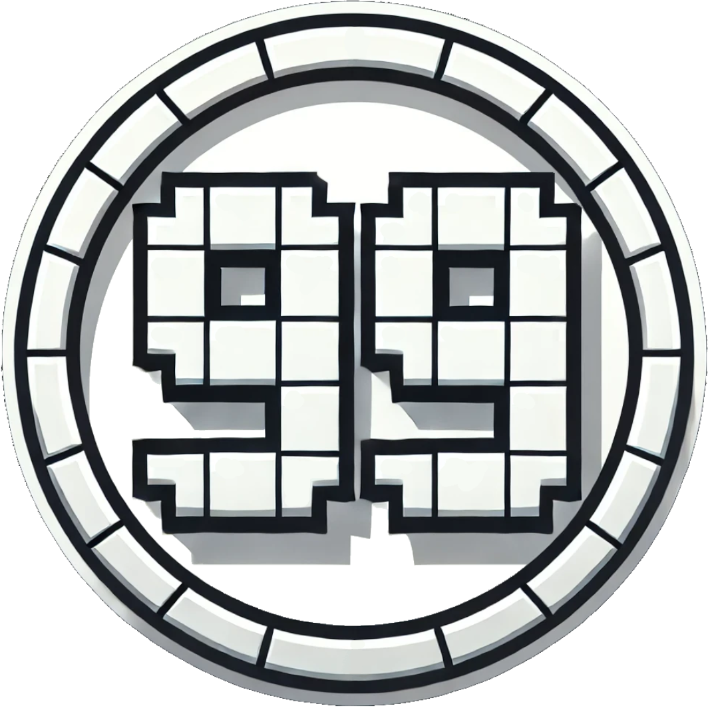

<h1 align="center">Counter  
	
	
	
	
	
      
</h1>

**Counter Mod** adds **Day** and **Death** counters to your Minecraft experience, allowing players to track world progression and keep an organized record of how many times they (or others) have died. Additionally, the mod provides an option to replace the **vanilla ping bars** in the player list (**Tab menu**) with a **color-coded numeric ping**, so you can see your exact latency (e.g. “123ms”) at a glance. These features are all **highly configurable**, making the mod perfect for both singleplayer and multiplayer servers.

## **Features**
✅ **Day Counter**
- Displays the current Minecraft day.
- Can be shown as an **overlay** or in **chat when joining** a world.
- Server administrators can enable or disable chat messages.

✅ **Death Counter**
- Tracks the number of deaths per player.
- Supports an **overlay**, a **chat leaderboard**, and **admin control over death counts**.
- **Configurable list size**: Choose how many players are shown in the leaderboard.
- **Singleplayer vs. Multiplayer**: In **singleplayer**, players only see their own deaths, while in **multiplayer**, a leaderboard can be displayed.

✅ **Ping as Text**  
- Replaces the default ping bars in the **Tab** list with a numeric readout (e.g. `123ms`).  
- Can be color-coded (green, orange, red) based on the ping value.  
- Easily toggled in the **client-config** (`showPingAsText`).  
- If toggled off, the vanilla ping bars reappear.

---

## **⚙️ Configuration Options**
The Counter Mod provides extensive configuration options via **`server-config.toml`** and **`client-config.toml`**.

### **Client Configuration (`client-config.toml`)**

#### Day Counter Overlay Settings
| Option               | Default | Description                                                            |
|----------------------|---------|------------------------------------------------------------------------|
| `showDayOverlay`     | `true`  | Enable/disable the day overlay on the client side.                     |
| `dayOverlayX`        | `0.05`  | Relative X position (0.0 = left, 1.0 = right) of the day overlay.      |
| `dayOverlayY`        | `0.05`  | Relative Y position (0.0 = top, 1.0 = bottom) of the day overlay.      |
| `dayOverlaySize`     | `1.0`   | Font size scaling factor for the day counter text.                     |

#### Death Counter List Settings
| Option                | Default       | Description                                                                           |
|-----------------------|---------------|---------------------------------------------------------------------------------------|
| `showDeathListOverlay`| `true`        | Enable/disable the death list overlay (list of all players' deaths).                  |
| `deathListX`          | `0.05`        | Relative X position for the death list overlay (0.0 = left, 1.0 = right).             |
| `deathListY`          | `0.05`        | Relative Y position for the death list overlay (0.0 = top, 1.0 = bottom).             |
| `deathListSize`       | `1`           | Font size scaling factor for the death list overlay.                                  |
| `deathOverlayWidth`   | `120`         | Max width (in pixels) for the death list overlay (affects layout).                    |
| `deathOverlayStyle`   | `TABLE`       | Style used to display the death list: **CLASSIC**, **BOXED**, or **TABLE**.           |

#### Death Counter Self Settings
| Option                | Default | Description                                                             |
|-----------------------|---------|-------------------------------------------------------------------------|
| `showDeathSelfOverlay`| `true`  | Enable/disable the personal death counter overlay (for your own deaths).|
| `deathSelfX`          | `0.10`  | Relative X position (0.0 = left, 1.0 = right) for your death overlay.   |
| `deathSelfY`          | `0.10`  | Relative Y position (0.0 = top, 1.0 = bottom) for your death overlay.   |
| `deathSelfSize`       | `1`     | Font size scaling factor for your personal death counter text.          |

#### Tab Overlay Settings
| Option                | Default | Description                                                                |
|-----------------------|---------|----------------------------------------------------------------------------|
| `showPingAsText`| `true`  | Show the ping as text (e.g. '123ms') instead of the default bars in the tab list?|

---

### **Server Configuration (`server-config.toml`)**

#### Day Counter Settings
| Option                | Default | Description                                                               |
|-----------------------|---------|---------------------------------------------------------------------------|
| `enableDayCounter`    | `true`  | Enables or disables the entire Day Counter feature on the server.         |
| `enableDayMessage`    | `true`  | Displays a **chat message** whenever a new day begins.                    |
| `showOverlay`         | `true`  | Allows the **Day Counter overlay** to be shown (client can toggle).       |
| `showDayInChat`       | `true`  | Shows the **current day in chat** when a player joins the server.         |

#### Death Counter Settings
| Option                     | Default | Description                                                                                                  |
|----------------------------|---------|--------------------------------------------------------------------------------------------------------------|
| `enableDeathCounter`       | `true`  | Enables or disables the Death Counter feature on the server.                                                 |
| `showDeathOverlay`         | `true`  | Allows the **Death Counter overlay** to be shown (client can toggle).                                        |
| `maxPlayersShown`          | `5`     | Number of players displayed in the **death leaderboard**.                                                    |
| `showDeathOverlayAlways`   | `false` | If `true`, the overlay is **always visible**; otherwise, it appears when pressing **Tab** (or in Edit Mode). |
| `deathOverlayMode`         | `LIST`  | Display mode: **`ONLY_SELF`** = show your own deaths only, **`LIST`** = show all players, **`BOTH`** = both. |

#### Death Counter Chat Settings
| Option                          | Default | Description                                                                                             |
|---------------------------------|---------|---------------------------------------------------------------------------------------------------------|
| `showDeathInChat`               | `true`  | If `true`, the server will send death counter info to chat (e.g. on join or on death).                  |
| `showDeathInChatMode`           | `BOTH`  | When to display deaths in chat: **`ON_JOIN`**, **`ON_DEATH`**, or **`BOTH`**.                           |
| `deathChatMode`                 | `LIST`  | Chat style: **`ONLY_SELF`** (each player sees only their own total) or **`LIST`** (show a leaderboard). |
| `showDeathListOnDeathGlobal`    | `false` | If `true`, shows the **death list** to all players when someone dies; otherwise only the victim sees it.|

---

## **📝 Commands**
Below is an overview of the main commands the mod provides:

| Command                                           | Permission | Description                                                        |
|---------------------------------------------------|-----------|---------------------------------------------------------------------|
| **`/counter day get`**                            | `all`       | Shows the current day counter value.                              |
| **`/counter day set <days>`**                     | `admin`   | Sets the Day Counter to the specified value.                        |
| **`/counter day reset`**                          | `admin`    | Resets the Day Counter to the real world day.                      |
| **`/counter death get`**                          | `all`       | Displays your own deaths.                                         |
| **`/counter death get <player>`**                 | `all`       | Displays another player's deaths.                                 |
| **`/counter death set <player> <amount>`**         | `admin`    | Sets the death count for the specified player(s).                 |
| **`/counter death reset`**                        | `admin`    | Resets the death count of all players to `0`.                      |

---

## **Overlay Edit Mode**
You can open an **Edit Screen** to reposition or toggle overlays:
1. Use the **keybind** (defined in controls) or any provided method to open the Overlay Edit Screen.
2. **Drag** each overlay to a new position.
3. Use the **“Toggle Overlay”** button to switch an overlay on or off.
4. Click **“Done”** to save your changes or **“Cancel”** to revert.

This makes it easy to configure how the day and death overlays appear on your client without manually editing the config files.

---

<h4 align="center">📢 **Found a bug? Have a suggestion?** 
Report issues to the <a href="https://github.com/BigBull-H3RO/Counter/issues">Issue Tracker</a></h4>

<h4 align="center">💡 Find out more about Counter on our <a href="https://www.curseforge.com/minecraft/mc-mods/counter-neoforge">Curseforge</a> or <a href="https://modrinth.com/mod/counter">Modrinth</a> Page</h4>
